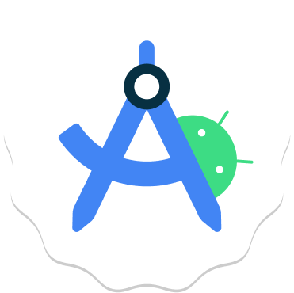

# Hi there 👋 I'm Kelvin

<!--
**kevin2-cyber/kevin2-cyber** is a ✨ _special_ ✨ repository because its `README.md` (this file) appears on your GitHub profile.

Here are some ideas to get you started:
-->

  

  

## My Trophies

- 🔭 I’m currently exploring:
    - Java
    - Data Structures and Algorithms.
    - Systems Design 
    - UI/UX Design
    - Software Engineering
- 🌱 I’m currently learning:
    - Java
    - Android development(Java & Kotlin)
    - Data Structures and Algorithms.
    - Web development
    - Backend development(Spring and SpringBoot)
    - UI/UX design
- 👯 I’m looking to collaborate on anything mobile development.
- 🤔 I’m looking for help with Software Engineering. 
- 💬 Ask me about anything relating to mobile development.
- 📫 How to reach me:
    -  Email me: kimikevin@zoho.com
    -  [Twitter](https://twitter.com/KimiKevin2?t=zSovVZNdftPwOM8lRfwWag&s=08)
    -  [LinkedIn](https://www.linkedin.com/in/kelvin-eduful-294712237/)
- 😄 Pronouns: He
- ⚡ Fun fact: Loves playing guitar and loves reading 

## 🚀 Tools and Languages

    
    
    
    
    
    
    

## My Progress

  
  

