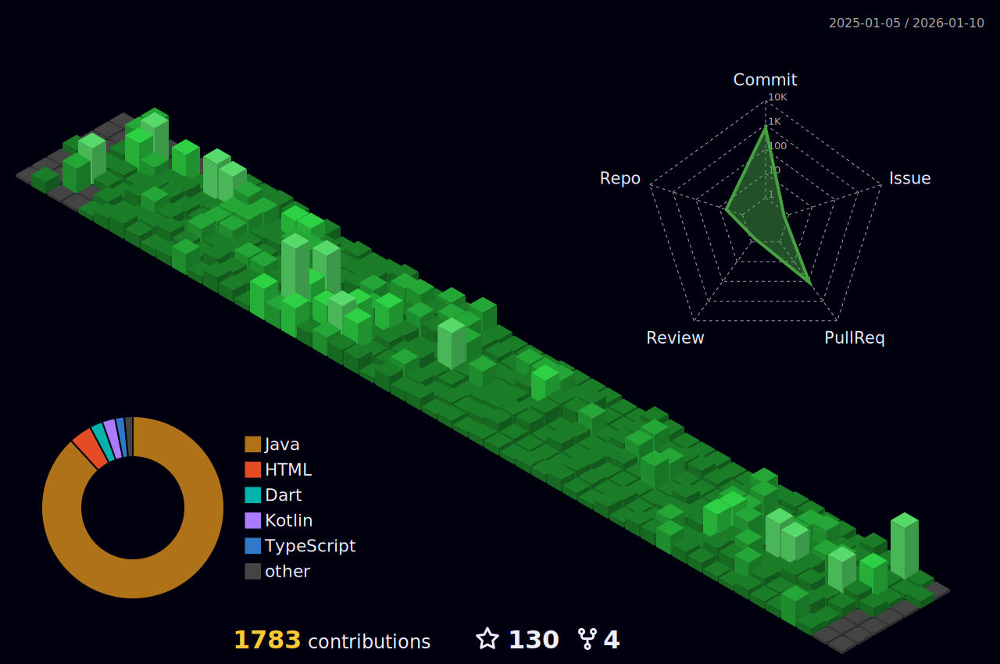

# Hi there 👋 I'm Kelvin

<!--
**kevin2-cyber/kevin2-cyber** is a ✨ _special_ ✨ repository because its `README.md` (this file) appears on your GitHub profile.

Here are some ideas to get you started:
-->

  

  

- 🔭 I’m currently working on a Whatsapp Clone, Recipe app and a notes app
- 🌱 I’m currently learning android development using kotlin and java,flutter and web development
- 👯 I’m looking to collaborate on anything mobile development.
- 🤔 I’m looking for help with ...
- 💬 Ask me about ...
- 📫 How to reach me: ...
- 😄 Pronouns: ...
- ⚡ Fun fact: ...
## My Progress

